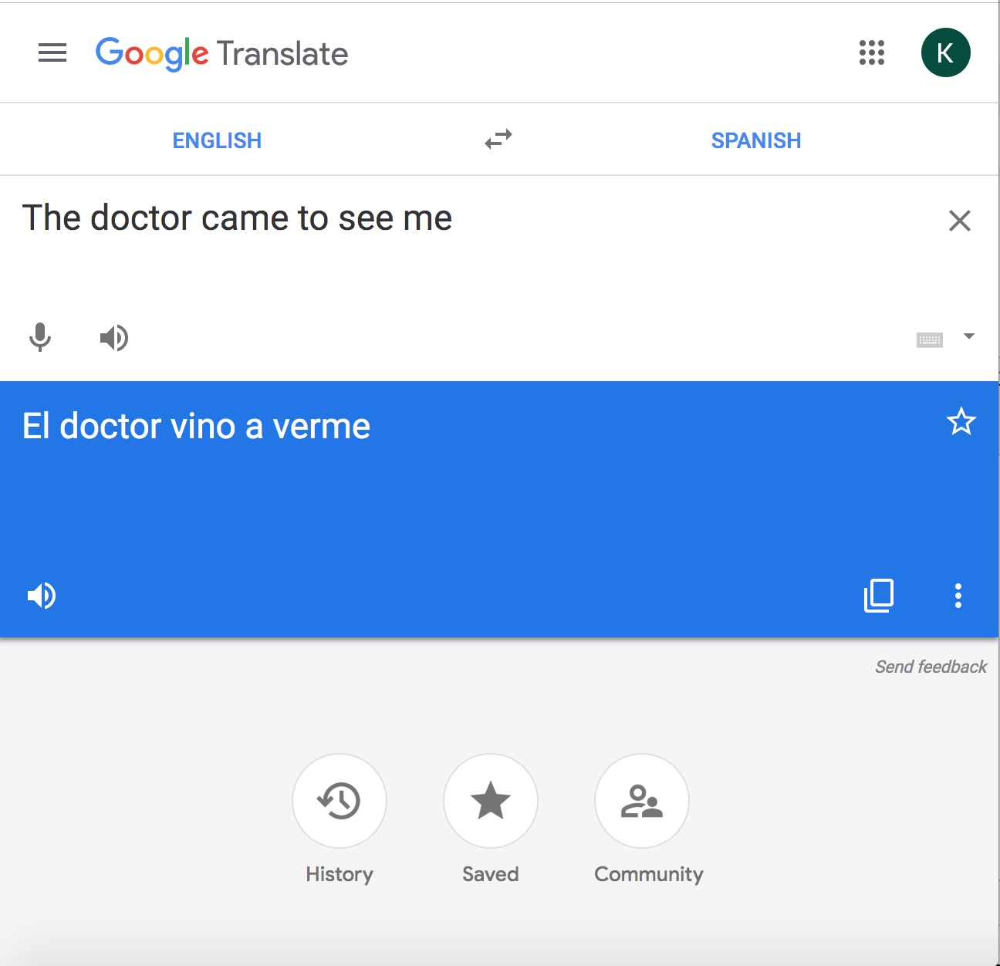

<h2> Word Embeddings </h2>

RNNs are often used to process language, for example to map from one sequence of
words to another sequence of words. RNNs, like other NNs, take vectors as input,
so to get them to process words we need some way of turning words into vectors.
One way to do this is with a one-hot encoding (like in Section 3). But there are
lots of other ways of coming up with lower dimensional but more informative
representations of words called "word embeddings".

One popular technique for producing word embeddings is called word2vec. You can
read more about it <a href="https://en.wikipedia.org/wiki/Word2vec">on
wikipedia</a>, but briefly, it tries to assign each word a vector embedding such
that pairs of words that appear in a training sentence together have embeddings
that are close in vector space.

Here, we investigate a phenomenon that will affect any RNN that uses these
embeddings. We've trained embeddings for all the words that appeared in a large
dataset of news articles. Instead of loading embeddings for every word in this
set (together they take up about 3 GB!), we have pre-selected several words
whose embeddings have interesting properties. 

`words = ["woman", "man", "boy", "girl", "doctor", "nurse", 
         "programmer", "homemaker", "queen", "king", "receptionist", 
         "librarian", "socialite", "hairdresser", "nanny", "bookkeeper", 
         "stylist", "maestro", "protege", "philosopher", "captain", 
         "architect", "surgeon", "brilliant", "mother", "father"]`

<b> 4A) </b> The function below computes the cosine distance between two
embedding vectors:

<displaymath>
d(w_1, w_2) = 1 - \frac{w_1 \cdot w_2}{||w_1|| ||w_2||}
</displaymath>

[Note that the distance increases as the angle between two vectors increases.]
Find the distances between pairs of words from this list.  Compare the distances
to each other. Which relative distances are as expected?  Which are unexpected?

<b> 4B) </b> In which cases might the unexpected distances have unintended
consequences? Why might this be happening? 

<b>Food for thought</b>

<ul>
<li> <a href="https://mashable.com/2017/11/30/google-translate-sexism/"> Here's an example of Google translate's outputs being negative affected by this </a>
<li> <a href="https://www.blog.google/products/translate/reducing-gender-bias-google-translate/"> And here is their (supposed) fix </a>
<li>But look at what happens in Spanish ("el doctor" is a male doctor, whereas "la doctora" would've been the female version) (as of 20 November 2019 -- feel free to try this out yourself!)

<li> <a href="https://papers.nips.cc/paper/6228-man-is-to-computer-programmer-as-woman-is-to-homemaker-debiasing-word-embeddings.pdf"> Here's a paper that works on debiasing such embeddings </a>
</ul>

<h3>Discussion Guide</h3>

4A) "mother" is closer to "woman" than it is to "man"; similarly, "father" is closer to "man" than to "woman". Same trend with "king"/"queen". However, non-gendered professions such as "nanny", "programmer" (!), "architect", and "receptionist" show a gender bias.
 
4B) Machine translation might show this bias (e.g., the doctor example in Spanish); resume processing, e.g. -- if someone had been a part of "Society of Women Engineers," that might move the embedding of the resume away from "programmer"
  
